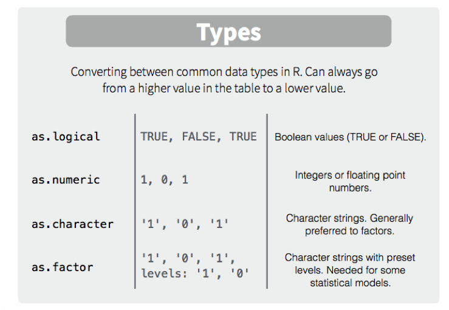
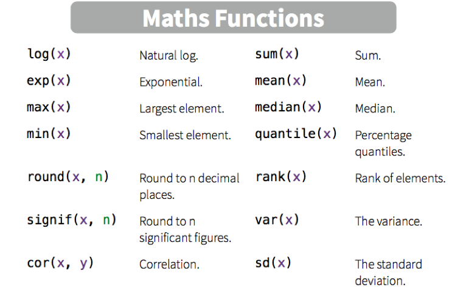
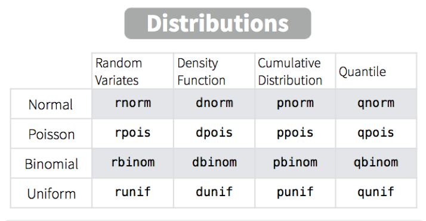
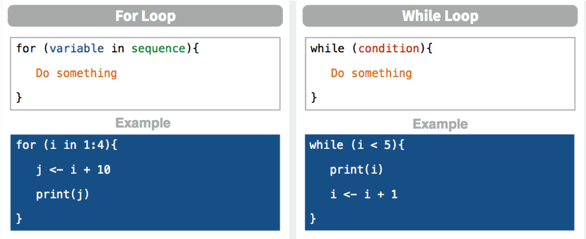

## R语法基础入门 
Ｒ的基础知识

* R中的数据对象：
  -向量
  -矩阵
  -数据框
  -数组
  -列表
* 函数
* 条件语句
* 循环

# R 语言中的数据对象

## 对象
Everything in S(R) is an object;
Every object is S(R) has a class.

* 向量
* 矩阵
* 数组
* 数据框
* 列表
* 函数

## 基本对象：向量

- 单个数值（标量）是向量的一种特例
- 向量元素的模式（mode）：整型（integer）、数值型（numeric）、字符型（character）、逻辑型（logical）、复数型（complex）
- 循环补齐（recycle）：在一定情况下自动延长向量
- 筛选：提取向量子集
- 向量化：对向量的每一个元素应用函数
- 使用seq()创建向量
- 使用rep()重复向量常数

## 基本对象：向量-构建
```{r eval=FALSE}
c(0,1,1,2,3,9) # 只能为用一类型的元素 c(0,1,"1",2,3,9)
c("hello world", "I am a R user")
c(TRUE,FALSE,TRUE,FALSE)
c(1,2,3,4) + c(3,4,5,6)
c(1,2,3,4) + c(1,2,3) # 长短不一,出现warning
c(1,2,3,4) > c(1,2,1,2) #比较大小
1:6
seq(2,10,2) # 起 止 步长
1:10 + 2
rep(1:3,times=3)
rep(1:3,each=3)
```

## 基本对象：向量-函数
赋值操作符:"`=`”或"`<-`"。
```{r}
x <- c(1,2,3,4,1,3)
log(x)
sort(x)
rev(x)
table(x)
unique(x)
```

##  基本对象：向量-函数
```{r,eval=FALSE}
v <- rnorm(10,mean=1,sd=1) # 从正态分布中取随机数
vec_max <- max(v)
vec_min <- min(v)
v<vec_max & v>vec_min
vector_trimmed <- v[v<vec_max & v>vec_min]
vec_mean <- sum(vector_trimmed)/length(vector_trimmed)
```

## 基本对象：向量-提取
从变量x中取出元素，可使用方括号加索引号：
```{r eval=FALSE}
x[2]   # 第二个元素
x[2:4] # 第2-4个元素
x[c(1,5)]
x[-4]  # 删除第4个元素后的其他部分
x[x>2] # 大于2的元素
which(x>2) # 大于2的元素的位序
x[x %in% c(1,2)] # 属于集合的元素
names(x) <- letters[1:6] # 向量的元素名
x["b"] # 以元素名提取元素
```

## 基本对象：向量-类型转换


## 基本对象：向量-类型转换
```{r}
x <- c(1,2,3,4,1,3)
x[7] <- "9"
x
as.numeric(x)
x2 <- c(0,1,1,1,0)
as.logical(x2)
```


## 基本对象：矩阵
```{r eval=FALSE}
vector <- 1:12  
is.matrix(vector)  # 向量是矩阵
# 方法1
my_mat <- matrix(vector,nrow=3,ncol=4,byrow=F) 
dim(my_mat)
# 方法2
dim(vector) <- c(3,4)
print(vector)
vector[2,2] <- "A"  # 元素全部变成了字符;矩阵内元素模式相同。
as.vector(vector)  # 转为向量，逐列 c(vector) 
# 行列名
rownames(my_mat)<-c("row1","row2","row3")
colnames(my_mat)<-c("col1","col2","col3","col4")
dimnames(my_mat)
```

## 基本对象：矩阵
```{r eval=FALSE}
# 矩阵扩展
vector1 <- rnorm(4);vector2 <- rnorm(3)
my_mat1 <- rbind(my_mat,vector1)
my_mat2 <- cbind(my_mat,vector2)
# 转置
t(my_mat1)
# 元素比较
my_mat1>0
ifelse(my_mat1>0,1,0)
```

## 数组
数组(Array)维度2：
```{r}
a <- array(1:12,dim=c(2,3,2))
print(a)
```
行、列、块
```{r eval=FALSE}
a[1,,2]
a[2,1,2]
```

## 基本对象：数据框
各列的mode可以不一样。
```{r}
city <- c('A','B','C','D')
temp = c(27,29,23,14)
pop = c(300,200,150,2300)
data <- data.frame(city,temp,pop)
str(data)
```

提取数据框中的元素
```{r eval=FALSE}
data[1]  # 默认取列
data[[1]] # 本质是一个list（后文）
data[ ,1]
data[, 'city']
data$city

```

## 基本对象：数据框
```{r}
data <- data.frame(city,temp,pop,stringsAsFactors=F) # 字符不转换因子
str(data)
```

## 基本对象：数据框
了解一个数据框的基本属性。
```{r eval=FALSE}
data <- data.frame(city,temp,pop)
summary(data)
dim(data)
head(data,2)
tail(data)
str(data)
```
summary函数负责对每列进行统计，dim得到维度，head得到前六行数据，而str则返回整个数据的结构。

## 基本对象：数据框
尝试找出高于平均温度的城市，先求平均气温。
数据框排序、计算
```{r eval=FALSE}
order(data$temp)
data[order(data$temp),]
data[order(data$temp,decreasing=T),][1:2, ]
median(data$temp)
data<20
```

```{r}
data[data$temp>28, ]
ave <- mean(data$temp)
data[data$temp>ave, ]
```

数据框的更多介绍在后面会介绍！

## 列表

列表(List)是最为灵活的数据结构，可由不同类型的对象组合而成，长度不定

```{r}
data_list = list(temp=temp,pop=pop)
print(data_list)

```
```{r eval=FALSE}
data_list$mat <- my_mat
data_list$data <- data
```

## 列表
列表提取元素，用两个方括号。例如提取最后一个data元素。

```{r eval=FALSE}
names(data_list)
length(data_list)
data_list[[2]]
```

## 工作空间

工作空间

- `ls()`  列出当前工作空间中的对象/变量
- `rm(objectlist)`  移除（删除）一个或多个对象
- `save.image("myfile")`	保存工作空间到文件myfile中（默认后缀 .RData）
- `save(object, file="myfile")`	保存指定对象到一个文件中
- `load("myfile")`读取一个工作空间到当前会话中


## 算术运算小结

- `x + y`     加法
- `x - y`     减法
- `x * y`     乘法
- `x / y`     除法
- `x ^ y`     乘幂
- `x %% y`    模运算(求余数)
- `x %/% y`   整数除法()


## 逻辑运算小结

- `x == y`    判断是否相等
- `x <= y`    判断是否小于等于
- `x >= y`    判断是否大于等于
- `x & y`     向量的逻辑"与”运算（x、y以及运算结果都是向量）
- `x | y`     向量的逻辑"或”运算（x、y以及运算结果都是向量）
- `!x`        逻辑非
- `%in%`      包含
- 逻辑值`TRUE`和`FALSE`可以缩写为`T`和`F`（两者都必须是大写）。而在算术表达式它们会转换为1和0

# 函数

## 函数的构成
函数由三部分构成，即输入、运算、输出。
```{r}
exp(1)
exp(c(1,2,3,4))
```
`exp`是函数名，括号中是参数。

## 常见函数


## 随机函数
通过帮助文件自己学习，理解这些函数。比方说pnorm(1.96)


## 自定义函数
求圆面积的函数
```{r}
myfunc <- function(r) {
  area <- pi*r^2
  return(area)
  }
print(myfunc(4))
```
函数在调用时会新建一个特殊的子环境，用以处理函数中涉及到的变量；函数中的area变量为局部变量，不会在全局环境中出现而影响其它函数，使用起来非常安全；函数内部可以调用全局变量如上面的pi。

## 批量应用函数
将求圆面积的函数用于一个矩阵中的2个变量
```{r}
atmp <- 1:6;dim(atmp) <- c(3,2)
# myfunc(tmp) # 无法直接使用
sapply(atmp,myfunc)
sapply(3:5, seq)
```

## 条件语句


## 条件语句

通常R代码的执行是按行顺序执行的，但有时需要根据条件来执行某些分支代码
```{r}
num <- 5
if (num %% 2 != 0) {
  cat(num,'is odd')
}
```

## 条件判断
if只是单一判断是否执行某条代码，若需要多分支判断，可增加else语句，例如增加奇数和偶数的屏幕输出。
```{r}
num <- 4
if (num %% 2 != 0) {
  cat(num, 'is odd')
} else {
  cat(num, 'is even')
}
```

## 条件判断
对于超过两个分支的条件判断，我们可以使用多重嵌套的if-else语句。例如计算某个数字和3相除的余数。
```{r}
num <- 10
if (num %% 3 == 1)  {
  cat('mode is',1)
} else if (num %% 3 == 2) {
  cat('mode is',2)
} else {
  cat('mode is',0)
}
```


## 二元判断函数

ifelse可用于向量化计算，例如判断多个数字是奇数还是偶数。
```{r}
num <- 1:6
ifelse(num%%2==0, yes='even',no='odd')
```
ifelse的嵌套
```{r}
num <- sample(20:70,20,replace=T)
res <- ifelse(num>50,'老年',ifelse(num<30,'青年', '中年'))
```


## 函数中缺失值的处理+空值

真实的数据分析工作中会经常遇到数据缺失情况，缺失的数据在Ｒ中一般表示为NA。当一个数据中包含了NA时，很多函数的行为会不一样，甚至会产生错误。
```{r eval=FALSE}
temp <- c(27, 29, 23, 14,NA)
mean(temp)
mean(temp,na.rm=T)
is.na(temp)
```

## 缺失值与空值
缺失值的意义是应该有数据而没有，起到占位的作用。空值NULL则没有。temp只有四个元素。
```{r}
temp <- c(27, 29, 23, 14,NULL)
```
NULL用来删除变量或变量中的元素，例如删除data_list中的data元素。
```{r eval=FALSE}
data_list$data <- NULL
```

## 循环

循环语句可以重复运行某一段代码；for循环和while循环。


## 循环
for循环的终止条件是循环的次数，例如我们计算1到100所有奇数的和。

```{r}
x <- 0
for (i in 1:100) {
  if (i %% 2 != 0) {
    x <- x + i
  }
}
```

实际，计算奇数之和只需要一条代码即可，不用循环。

```{r eval=FALSE}
sum(seq(1,100,by=2))
```


## 循环

while循环的终止条件是达到某一个标准，还是计算上面同样的例子。

```{r}
x <- 0
i <- 1
while (i < 100) {
  if (i %% 2 != 0) {
    x <- x + i
  }
  i <- i + 1
}
```


## 循环

还可以使用repeat来进行循环操作。仍是计算100以内的奇数之和。

```{r}
x <- 0
i <- 1
repeat  {
  if (i %% 2 != 0) {
    x <- x + i
  }
  i <- i + 1
  if (i > 100) break
}
```

## 循环
循环中另外一个常见的命令是next，也就是跳过循环中next后面的代码，而重新开始一次循环。

```{r}
x <- 0
i <- 0
repeat  {
  i <- i + 1
  if (i > 100) break
  if (i %% 2 == 0) next
  x <- x + i
}
```

## 课后强化练习

基础部分
认真研读[R语言基础小抄](http://github.com/rstudio/cheatsheets/raw/master/base-r.pdf)，并将相关的代码输入到R代码文件中。
- [Chapter 1 Intro to basics](https://campus.datacamp.com/courses/free-introduction-to-r/chapter-1-intro-to-basics-1?ex=1)
- [Chapter 2 Vectors](https://campus.datacamp.com/courses/free-introduction-to-r/chapter-2-vectors-2?ex=1)
- [Chapter 4 Factors](https://campus.datacamp.com/courses/free-introduction-to-r/chapter-4-factors-4?ex=1)
- [Chapter 5 Data frames](https://campus.datacamp.com/courses/free-introduction-to-r/chapter-5-data-frames?ex=1)

中级部分

- [Chapter 1 Conditionals and Control Flow](https://campus.datacamp.com/courses/intermediate-r/chapter-1-conditionals-and-control-flow?ex=1)
- [Chapter 3 Functions](https://campus.datacamp.com/courses/intermediate-r/chapter-3-functions?ex=1)

[更多小抄](https://www.rstudio.com/resources/cheatsheets/)


